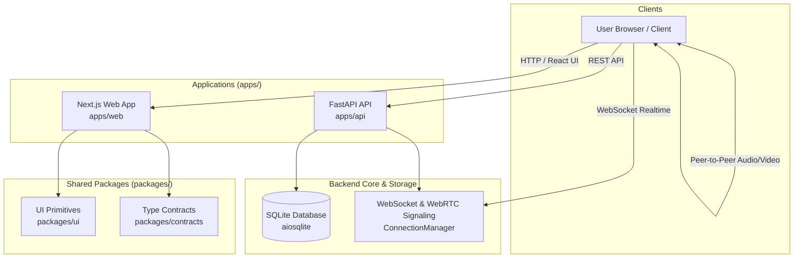

# Zoom Clone — Full-Stack Video Conferencing Platform

A faithful, modern video conferencing web application inspired by Zoom's core meeting workflows, design system, and real-time coordination. Engineered with a Next.js 16 frontend, FastAPI modular monolith backend, SQLite persistence, and WebRTC signaling.

---

## 1. Overview

Zoom Clone is structured as a professional, lightweight monorepo designed for clean separation of concerns, high maintainability, and zero-friction developer setup.



---

## 2. Key Capabilities

### Implemented
- **Instant Meetings**: Immediate meeting room creation with 10-digit numeric ID, 6-character alphanumeric passcode, and unique invite token.
- **Meeting Scheduling**: Future scheduling with duration validation (1 - 1440 min) and UTC timezone awareness.
- **Meeting State Machine**: Deterministic transitions (`SCHEDULED` -> `LIVE` -> `ENDED` / `CANCELLED`) with join validation.
- **Host Controls & Moderation**: Mute individual participant, host mute-all, and kick/remove participant.
- **Participant State**: Live microphone mute, camera toggle, and arbitrated screen sharing (max 1 active sharer).
- **Real-Time Collaboration**: In-meeting chat history and ephemeral emoji reactions (`thumbs_up`, `clap`, `heart`, etc.).
- **WebSockets & WebRTC Signaling**: Peer-to-peer session description (SDP offer/answer) and ICE candidate routing.
- **Database Architecture**: 6 normalized relational entities, UUID string primary keys, `selectinload` async relationships.
- **Automated Verification**: 66 passing Pytest tests, 0 Ruff lint errors, 0 Mypy static typing errors across 57 source files.

### Scaffolded
- **Frontend Monorepo Application (`apps/web`)**: Next.js 16 with Turbopack, Tailwind CSS v4, Lucide icons, and Framer Motion.
- **Design System Primitives (`packages/ui`)**: Modular UI package structure with class merge utilities and component interfaces.
- **Contract Layer (`packages/contracts`)**: Complete TypeScript definitions matching backend schemas.

### Planned (Phase 2)
- High-fidelity Zoom meeting room UI (Speaker Grid, Participants Drawer, Chat Drawer, Reaction Toasts).
- Dashboard homepage with Upcoming and Recent meetings interactive cards.
- Screen share video rendering and WebRTC media stream binding.

---

## 3. Monorepo Structure

```
Zoom-Clone/
│
├── apps/
│   ├── web/                         # Next.js 16 frontend application
│   └── api/                         # FastAPI modular monolith backend
│
├── packages/
│   ├── ui/                          # Reusable frontend UI primitives
│   └── contracts/                   # API DTOs & WebSocket event contracts
│
├── docs/
│   ├── architecture/                # System architecture & Mermaid diagrams
│   ├── api/                         # REST & WebSocket protocol specifications
│   ├── database/                    # ER diagram and SQLite indexing strategy
│   ├── development/                 # Local setup and workflow guide
│   └── decisions/                   # Architecture Decision Records (ADRs)
│
├── Execution_Prompts/               # Master execution prompts & specifications
├── UI_UX_Mockups/                   # High-fidelity Zoom UI reference screenshots
│
├── package.json                     # Monorepo workspaces definition
├── pnpm-workspace.yaml              # pnpm workspace configuration
├── .gitignore                       # Universal Python, Node & Next.js exclusions
└── README.md                        # Root project documentation
```

---

## 4. Quick Start

### Backend API (`apps/api`)
```bash
cd apps/api

# 1. Activate virtual environment
.\.venv\Scripts\Activate.ps1

# 2. Run database migrations & seed deterministic sample data
$env:PYTHONPATH = "."
python -m alembic upgrade head
python scripts/seed_db.py

# 3. Start development server
python -m uvicorn app.main:app --host 127.0.0.1 --port 8000 --reload
```
Interactive Swagger Documentation: 👉 **`http://127.0.0.1:8000/docs`**

### Frontend Web (`apps/web`)
```bash
# From repository root
npm install
npm run dev:web
```
Next.js Application: 👉 **`http://localhost:3000`**

---

## 5. Quality & Test Verification

All backend tests and static checks execute cleanly with zero errors:

```bash
cd apps/api
$env:PYTHONPATH = "."

# 1. Automated Test Suite (66 / 66 passing)
.\.venv\Scripts\python -m pytest -v

# 2. Ruff Linter (0 errors)
.\.venv\Scripts\python -m ruff check .

# 3. Ruff Formatter (Clean)
.\.venv\Scripts\python -m ruff format --check .

# 4. Mypy Type Checker (57 files checked, 0 errors)
.\.venv\Scripts\python -m mypy app
```

---

---

## 6. Auto-Deploy to Production

Automated with **GitHub Actions** on every commit to `main`:
- **Direct Auto-Deploy:** Bypasses pre-deploy test checks and immediately triggers production deployments.
- **Vercel (Frontend):** Auto-deploys `apps/web` to `https://zoom-clone-web-gamma.vercel.app`.
- **Render (Backend):** Auto-deploys `apps/api` to `https://zoom-clone-hvoi.onrender.com`.
- See the [Auto-Deploy Guide](docs/CICD_SETUP.md) for details on Deploy Hooks.

---

## 7. Detailed Documentation

- [CI/CD & Deployment Guide](docs/CICD_SETUP.md)
- [Architecture Overview](docs/architecture/overview.md)
- [REST API Reference](docs/api/rest-api.md)
- [WebSocket & WebRTC Protocol](docs/api/websocket-protocol.md)
- [Database Schema & ER Diagram](docs/database/schema.md)
- [Developer Setup Guide](docs/development/getting-started.md)
- [ADR 001: Modular Monolith](docs/decisions/adr-001-modular-monolith.md)

