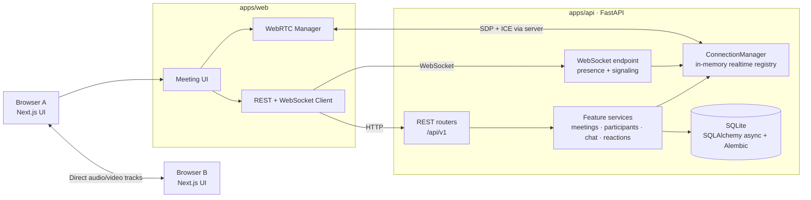
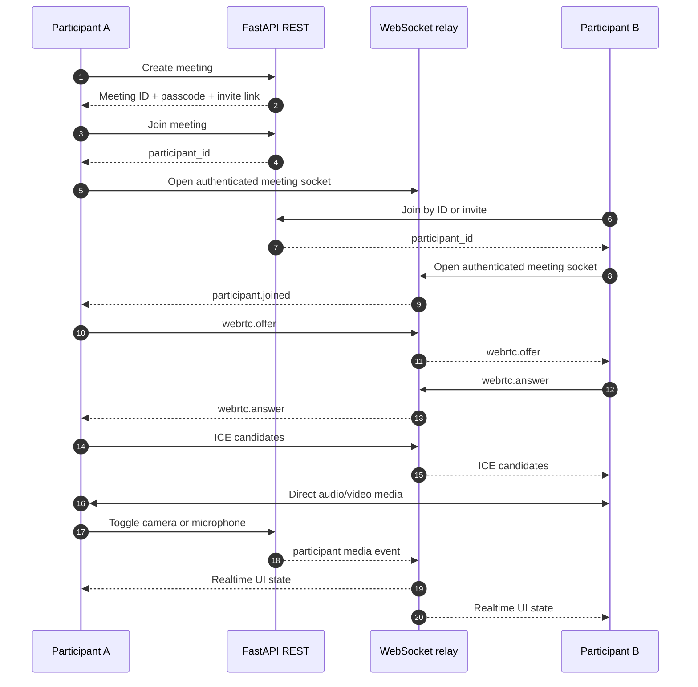

<div align="center">

# Zoom Clone

### A real-time video-conferencing platform built with Next.js, FastAPI and WebRTC

<p>
  <a href="https://github.com/aditya-raj9125/Zoom-Clone"></a>
  
  
  
</p>

<p><sub>A polished full-stack meeting prototype with live presence, camera and microphone state, peer-to-peer media, chat, reactions, screen sharing, scheduling and host moderation.</sub></p>

</div>

> **Project status** · Functional full-stack prototype · REST + WebSocket realtime layer · WebRTC mesh media · Automated deployment configured for Vercel and Render

## Contents

- [What this project is](#what-this-project-is)
- [Features](#features)
- [Architecture at a glance](#architecture-at-a-glance)
- [Repository layout](#repository-layout)
- [Quick start](#quick-start)
- [Configuration](#configuration)
- [How a meeting works](#how-a-meeting-works)
- [Verification](#verification)
- [Deployment](#deployment)
- [Assumptions and limitations](#assumptions-and-limitations)
- [Documentation map](#documentation-map)

## What this project is

Zoom Clone is a modular-monolith monorepo for a browser-based meeting experience. The Next.js client owns the product interface and browser media lifecycle. The FastAPI service owns meeting lifecycle, authorization, persistence, REST APIs, realtime event broadcasting and WebRTC signaling. Audio and video stay peer-to-peer between browsers; the server relays only signaling metadata.

The repository is intentionally small enough to run locally without Docker, Redis or a media server, while keeping clear boundaries that can evolve toward an SFU-backed production architecture later.

## Features

| Area | Included behavior |
| --- | --- |
| Meetings | Instant meetings, scheduled meetings, passcodes, invite links, lifecycle state machine |
| Participants | Join/leave presence, opaque participant IDs, active participant list |
| Media | Live microphone/camera controls, remote audio playback, screen-share state, device fallback |
| WebRTC | SDP offer/answer, ICE exchange, early-signal buffering, serialized signaling, peer cleanup |
| Collaboration | Persisted chat history, realtime chat broadcast, emoji reactions |
| Moderation | Host mute, mute-all, remove participant, single active screen sharer |
| Identity | Local/default user flow, JWT-ready auth module, optional Google OAuth configuration |
| Developer experience | Alembic migrations, seed script, OpenAPI/Swagger, typed shared contracts, tests |

## Architecture at a glance



### Runtime responsibilities

- **Browser**: renders the interface, asks for media permissions, owns `RTCPeerConnection` objects and plays remote streams.
- **REST API**: creates meetings, validates joins, persists state and applies host permissions.
- **WebSocket layer**: broadcasts presence/media events and forwards WebRTC offer, answer and ICE payloads.
- **Database**: stores durable meeting, participant, event, chat and reaction records.
- **Shared packages**: keep UI helpers and frontend contracts reusable across applications.

## Repository layout

```text
Zoom-Clone/
├── apps/
│   ├── api/                 # FastAPI modular monolith
│   └── web/                 # Next.js 16 application
├── packages/
│   ├── contracts/           # Shared TypeScript DTO and event types
│   └── ui/                  # Reusable UI primitives and styling helpers
├── docs/
│   ├── architecture/        # System design and runtime flows
│   ├── api/                 # REST and WebSocket protocol references
│   ├── database/            # ER model and persistence notes
│   ├── development/         # Local development and asset guides
│   └── decisions/           # Architecture Decision Records
├── Execution_Prompts/       # Project specifications and execution prompts
├── UI_UX_Mockups/           # Product and interface references
├── package.json             # Root npm scripts and workspaces
├── pnpm-workspace.yaml      # Workspace declaration
└── README.md               # Single canonical project guide
```

## Quick start

### Prerequisites

- Python **3.12+**
- Node.js **20+**
- npm or pnpm
- A browser that supports WebRTC and grants camera/microphone permissions

### 1. Install frontend dependencies

```bash
npm install
```

### 2. Prepare the API

PowerShell:

```powershell
cd apps/api
python -m venv .venv
.\.venv\Scripts\Activate.ps1
pip install -e ".[dev]"
Copy-Item .env.example .env
$env:PYTHONPATH = "."
python -m alembic upgrade head
python scripts/seed_db.py
```

macOS/Linux:

```bash
cd apps/api
python3 -m venv .venv
source .venv/bin/activate
pip install -e ".[dev]"
cp .env.example .env
export PYTHONPATH=.
python -m alembic upgrade head
python scripts/seed_db.py
```

### 3. Start both applications

Terminal 1 — API:

```bash
cd apps/api
# Activate .venv first
python -m uvicorn app.main:app --host 127.0.0.1 --port 8000 --reload
```

Terminal 2 — web:

```bash
npm run dev:web
```

Open [http://localhost:3000](http://localhost:3000). API documentation is available at [http://127.0.0.1:8000/docs](http://127.0.0.1:8000/docs) and [http://127.0.0.1:8000/redoc](http://127.0.0.1:8000/redoc).

## Configuration

### Backend environment

Copy `apps/api/.env.example` to `apps/api/.env`. Important settings include:

| Variable | Local default | Purpose |
| --- | --- | --- |
| `DATABASE_URL` | `sqlite+aiosqlite:///./data/zoom_clone.db` | Async SQLAlchemy database URL |
| `CORS_ORIGINS` | `http://localhost:3000,http://localhost:5173` | Allowed browser origins |
| `JWT_SECRET_KEY` | Development placeholder | Replace for deployment |
| `FRONTEND_URL` | `http://localhost:3000` | OAuth redirect and generated links |
| `GOOGLE_CLIENT_ID` | Empty | Optional Google OAuth client |
| `GOOGLE_CLIENT_SECRET` | Empty | Optional Google OAuth secret |
| `ENVIRONMENT` | `development` | Runtime mode |

### Frontend environment

The client derives local API and WebSocket URLs from the browser hostname. For deployment, configure:

```env
NEXT_PUBLIC_API_URL=https://your-api.example.com/api/v1
NEXT_PUBLIC_WS_URL=wss://your-api.example.com/api/v1/ws
```

Use `wss://` when the frontend is served over HTTPS.

## How a meeting works



The WebRTC path does not use page reloads, polling or repeated meeting recreation. Signaling is event-driven; the server buffers early signaling messages and the client queues ICE until a remote description exists.

## Verification

Backend checks:

```bash
cd apps/api
export PYTHONPATH=.
python -m pytest -q
python -m ruff check .
python -m ruff format --check .
python -m mypy app
```

Frontend checks:

```bash
npm --prefix apps/web run lint
npx tsc -p apps/web/tsconfig.json --noEmit
npm run build:web
```

The current backend suite contains 74 passing tests. Exact counts may change as features evolve; the commands above are the source of truth.

## Deployment

The repository is configured for:

- **Vercel** for `apps/web`
- **Render** for `apps/api`
- GitHub Actions workflow on pushes to `main`

See [CI/CD and deployment](docs/CICD_SETUP.md) for environment variables, deploy hooks, health checks and production notes.

## Assumptions and limitations

- WebRTC media is a peer-to-peer mesh. It is suitable for small rooms; larger rooms should move media routing to an SFU.
- The current signaling registry is in memory. Multi-instance deployment requires shared pub/sub, such as Redis.
- SQLite on Render uses the configured filesystem path and should be replaced with managed Postgres for durable production storage.
- Configure `NEXT_PUBLIC_WEBRTC_ICE_SERVERS` with TURN credentials in production. STUN-only connectivity is not reliable across corporate, mobile, or symmetric-NAT networks.
- `CORS_ORIGIN_REGEX` permits this project's Vercel preview deployments while keeping unrelated origins blocked.
- Synthetic media tracks are used when browser media devices are unavailable, allowing restricted/headless environments to keep functioning.
- The project is an educational/product prototype and does not claim Zoom’s production security, scale or compliance guarantees.

## Documentation map

| Guide | Use it for |
| --- | --- |
| [Architecture overview](docs/architecture/overview.md) | Components, boundaries, runtime flows and scaling path |
| [Developer setup](docs/development/getting-started.md) | Local setup, environment variables, commands and troubleshooting |
| [Asset catalog](docs/development/assets.md) | Frontend asset ownership and UI mapping |
| [REST API](docs/api/rest-api.md) | HTTP endpoints, request bodies and response conventions |
| [WebSocket/WebRTC protocol](docs/api/websocket-protocol.md) | Event envelopes, signaling lifecycle and media synchronization |
| [Database schema](docs/database/schema.md) | Entities, relationships, indexes and persistence decisions |
| [CI/CD and deployment](docs/CICD_SETUP.md) | Vercel, Render and GitHub Actions workflow |
| [ADR 001](docs/decisions/adr-001-modular-monolith.md) | Why the project uses a modular monolith and WebRTC mesh |

<div align="center">
  <sub>Built as a thoughtful, documented full-stack systems project.</sub>
</div>
