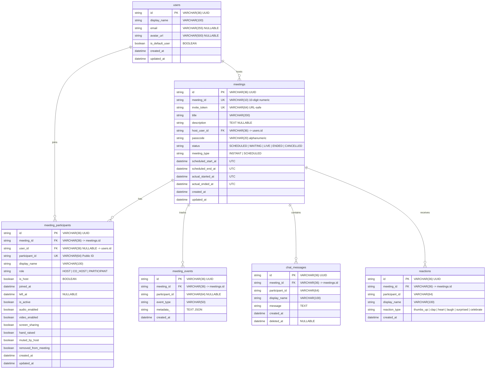

# Zoom Clone — Production-Ready FastAPI Backend

A high-performance, modular monolith backend for a real-time Zoom clone, engineered with FastAPI, SQLite (async via aiosqlite), SQLAlchemy 2.0 async ORM, Alembic migrations, and WebRTC signaling over WebSockets.

---

## Architecture Overview

The system follows a clean layered **Modular Monolith** architecture with strict domain boundaries and separation of concerns:

```
                  ┌─────────────────────────────────────────────────┐
                  │               FastAPI Application               │
                  └────────────────────────┬────────────────────────┘
                                           │
                        ┌──────────────────┴──────────────────┐
                        ▼                                     ▼
             REST Routers (/api/v1)              WebSocket (/api/v1/ws)
                        │                                     │
                        ▼                                     ▼
                Feature Services                      ConnectionManager
                        │                             (In-Memory Dispatch)
                        ▼
               Feature Repositories
                        │
                        ▼
             SQLAlchemy 2.0 Async ORM
                        │
                        ▼
             SQLite (aiosqlite) DB
```

### Layer Responsibilities

- **`app/core/`**: Central application configuration (Pydantic Settings), asynchronous database engine & session factory, security utilities (URL-safe tokens, cryptographically secure passcodes), structured logging, and application-wide domain exceptions.
- **`app/common/`**: Shared domain primitives, canonical enumerations (`MeetingStatus`, `MeetingType`, `ParticipantRole`, `ReactionType`), generic pagination models (`PaginatedResponse`), and standard JSON envelopes.
- **`app/features/users/`**: Default user identity management, user lookup repository, profile retrieval.
- **`app/features/meetings/`**: Meeting lifecycle state machine (`SCHEDULED`, `WAITING`, `LIVE`, `ENDED`, `CANCELLED`), 10-digit Zoom-like meeting ID generator, invite token and passcode generator, meeting creation, scheduling, start/end host flows.
- **`app/features/participants/`**: Participant joining (via 10-digit ID or invite link token), media state signaling (mute/unmute microphone, enable/disable camera, screen share arbitration), and host moderation controls (mute individual, mute all, kick/remove participant).
- **`app/features/realtime/`**: Connection registry, pub/sub broadcaster, WebRTC signaling relay (`webrtc.offer`, `webrtc.answer`, `webrtc.ice_candidate`), and structured event schemas.
- **`app/features/chat/`**: Real-time in-meeting chat messaging, audit storage, message broadcast.
- **`app/features/reactions/`**: Ephemeral in-meeting emoji reactions (`thumbs_up`, `clap`, `heart`, `laugh`, `surprised`, `celebrate`) with WebSocket broadcast.
- **`app/features/health/`**: Production readiness and liveness health probe endpoint verifying database connectivity.

---

## Database Schema



---

## API Reference

All REST endpoints are rooted at `/api/v1`.

### Health Check
| Method | Path | Description |
|---|---|---|
| `GET` | `/api/v1/health` | Service health status and database connectivity probe |

### Users
| Method | Path | Description |
|---|---|---|
| `GET` | `/api/v1/users/me` | Fetch the seeded default user (`Aditya Raj`) |

### Meetings Lifecycle & Scheduling
| Method | Path | Description |
|---|---|---|
| `POST` | `/api/v1/meetings` | Create an instant meeting (auto-generates 10-digit ID, passcode, invite token; sets status to `LIVE`) |
| `POST` | `/api/v1/meetings/schedule` | Schedule a future meeting (validates UTC future time, duration between 1 - 1440 min) |
| `GET` | `/api/v1/meetings/upcoming` | List future scheduled meetings for current user, ordered by `scheduled_start_at ASC` |
| `GET` | `/api/v1/meetings/recent` | Paginated list of recent meetings (`page`, `page_size`), sorted by `created_at DESC` |
| `GET` | `/api/v1/meetings/{meeting_id}` | Retrieve public meeting details by 10-digit ID |
| `POST` | `/api/v1/meetings/{meeting_id}/start` | Start scheduled meeting (host only; transitions status to `LIVE`, broadcasts `meeting.started`) |
| `POST` | `/api/v1/meetings/{meeting_id}/end` | End meeting (host only; transitions status to `ENDED`, deactivates participants, closes WebSockets) |

### Participant Management & Moderation
| Method | Path | Description |
|---|---|---|
| `POST` | `/api/v1/meetings/join` | Join meeting by 10-digit ID + passcode |
| `POST` | `/api/v1/meetings/join-by-invite` | Join meeting directly using the invite URL token |
| `GET` | `/api/v1/meetings/{meeting_id}/participants` | List currently active participants in the meeting |
| `POST` | `/api/v1/meetings/{meeting_id}/participants/{pid}/leave` | Participant leaves meeting voluntarily |
| `PATCH` | `/api/v1/meetings/{meeting_id}/participants/{pid}/audio` | Toggle audio mute state |
| `PATCH` | `/api/v1/meetings/{meeting_id}/participants/{pid}/video` | Toggle video camera state |
| `PATCH` | `/api/v1/meetings/{meeting_id}/participants/{pid}/screen-share` | Toggle screen share (arbitrated: max 1 active sharer) |
| `POST` | `/api/v1/meetings/{meeting_id}/participants/{pid}/mute` | Host muting a specific participant |
| `POST` | `/api/v1/meetings/{meeting_id}/mute-all` | Host muting all active participants at once |
| `DELETE` | `/api/v1/meetings/{meeting_id}/participants/{pid}` | Host removes/kicks a participant from the meeting |

### In-Meeting Chat & Reactions
| Method | Path | Description |
|---|---|---|
| `GET` | `/api/v1/meetings/{meeting_id}/chat` | Get chat history for a meeting |
| `POST` | `/api/v1/meetings/{meeting_id}/chat` | Send a chat message (persisted and broadcast via WebSocket) |
| `POST` | `/api/v1/meetings/{meeting_id}/reactions` | Send an emoji reaction (persisted and broadcast via WebSocket) |

### WebSocket Real-time & WebRTC Signaling
| Protocol | Path | Description |
|---|---|---|
| `WS` | `/api/v1/ws/meetings/{meeting_id}?participant_id={pid}` | Real-time events, presence, and WebRTC signaling relay |

#### WebRTC Signaling Message Format
Client to server message payload:
```json
{
  "type": "webrtc.offer",
  "data": {
    "target_participant_id": "TARGET_PID",
    "sdp": "v=0\r\no=- 42 2 IN IP4 127.0.0.1...",
    "type": "offer"
  }
}
```
Target participant receives:
```json
{
  "event": "webrtc.offer",
  "data": {
    "sender_participant_id": "SENDER_PID",
    "sdp": "v=0\r\no=- 42 2 IN IP4 127.0.0.1...",
    "type": "offer"
  }
}
```
Supported WebRTC event types: `webrtc.offer`, `webrtc.answer`, `webrtc.ice_candidate`.

---

## Getting Started

### 1. Requirements
- Python 3.12+
- Virtual environment (`venv`)

### 2. Setup Environment
```bash
cd backend
python -m venv .venv
.\.venv\Scripts\Activate.ps1
pip install -e ".[dev]"
```

### 3. Environment Configuration
```bash
Copy-Item .env.example .env
```
Default `.env` configuration:
```ini
ENVIRONMENT=development
DEBUG=true
DATABASE_URL=sqlite+aiosqlite:///./data/zoom.db
CORS_ORIGINS=["http://localhost:3000","http://127.0.0.1:3000"]
DEFAULT_USER_DISPLAY_NAME=Aditya Raj
DEFAULT_USER_EMAIL=aditya.raj@zoomclone.local
```

### 4. Run Migrations & Seed Database
```bash
$env:PYTHONPATH = "."
.\.venv\Scripts\alembic upgrade head
.\.venv\Scripts\python scripts/seed_db.py
```

Deterministic seed data created:
- **Default Host User**: `Aditya Raj` (`aditya.raj@zoomclone.local`)
- **Live Instant Meeting**: Meeting ID `8461249264` (Passcode `eWklt0`)
- **Upcoming Scheduled Meeting**: Meeting ID `8438826207` (Passcode `171694`)
- **Ended Historical Meeting**: Meeting ID `8444458920` (Passcode `481920`)

### 5. Start Application Server
```bash
$env:PYTHONPATH = "."
.\.venv\Scripts\uvicorn app.main:app --host 0.0.0.0 --port 8000 --reload
```
Interactive OpenAPI Swagger docs will be available at:
👉 **`http://localhost:8000/docs`**

ReDoc documentation:
👉 **`http://localhost:8000/redoc`**

---

## Testing & Quality Verification

### Run Automated Tests
```bash
$env:PYTHONPATH = "."
.\.venv\Scripts\pytest -v
```
**Results: 66/66 passing unit, integration, lifecycle, security, and WebSocket tests.**

### Run Linting & Code Style
```bash
$env:PYTHONPATH = "."
.\.venv\Scripts\ruff check .
```
**Result: All checks passed, 0 lint errors.**

### Run Static Type Checker
```bash
$env:PYTHONPATH = "."
.\.venv\Scripts\mypy app
```
**Result: Success: no issues found in 57 source files.**

---

## Architectural & Engineering Highlights

1. **Deterministic Meeting State Machine**: All status transitions (`SCHEDULED` -> `LIVE` -> `ENDED` / `CANCELLED`) are enforced via `MeetingStateMachine`. Invalid transitions raise explicit domain errors and return appropriate HTTP 409 Conflict.
2. **Robust Multi-Participant WebRTC Signaling**: Peer-to-peer signaling (`offer`, `answer`, `ice_candidate`) runs transparently over the authenticated WebSocket channel with sender/target routing.
3. **SQLite Async Compatibility**: Standard UUID strings (`VARCHAR(36)`) and `selectinload` relationships prevent SQLite parameter binding errors and avoid `MissingGreenlet` exceptions in async SQLAlchemy 2.0.
4. **Opaque Public Participant IDs**: Internal database IDs are never leaked to client applications; opaque URL-safe tokens are used for participant identification and invite sharing.
5. **Single Sharer Arbitration**: Host controls and participant screen sharing enforce single-sharer exclusivity at the domain service layer.
