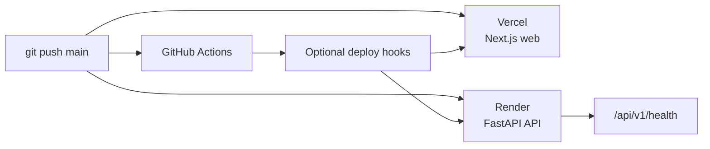

# CI/CD and Deployment

The repository deploys the two applications independently:



## Current targets

| Application | Platform | Repository path | Purpose |
| --- | --- | --- | --- |
| Web client | Vercel | `apps/web` | Next.js production build |
| API | Render | `apps/api` | FastAPI + migrations + Uvicorn |

The workflow file is `.github/workflows/ci-cd.yml`. It runs on pushes to `main` and can also be started manually.

## Frontend deployment

Configure the Vercel project with the repository and `apps/web` as its application root. Recommended environment variables:

```env
NEXT_PUBLIC_API_URL=https://your-render-service.onrender.com/api/v1
NEXT_PUBLIC_WS_URL=wss://your-render-service.onrender.com/api/v1/ws
```

The WebSocket URL must use `wss://` when the Vercel app is served over HTTPS.

## Backend deployment

`render.yaml` defines the Render service. The deployment sequence is:

1. Install `requirements.txt` and the editable package.
2. Run `alembic upgrade head`.
3. Start Uvicorn on Render’s `$PORT`.
4. Expose `/api/v1/health` as the health check.

Required production settings:

```env
ENVIRONMENT=production
DEBUG=false
DATABASE_URL=your-managed-database-url
JWT_SECRET_KEY=long-random-production-secret
FRONTEND_URL=https://your-vercel-domain
CORS_ORIGINS=https://your-vercel-domain
```

Google OAuth variables are optional unless that login flow is enabled.

## Deploy hooks

The workflow can call these optional GitHub repository secrets:

- `VERCEL_DEPLOY_HOOK_URL`
- `RENDER_DEPLOY_HOOK_URL`

If hooks are absent, the hosting platforms’ native Git integration can deploy on the `main` branch.

## Production checklist

- [ ] Replace the development JWT secret.
- [ ] Use a durable managed database instead of ephemeral SQLite storage.
- [ ] Set exact frontend origins in `CORS_ORIGINS`.
- [ ] Configure a TURN server for restrictive networks.
- [ ] Use `wss://` for production WebSockets.
- [ ] Confirm `/api/v1/health` is green after deploy.
- [ ] Verify meeting join, media permissions and leave cleanup from two browser sessions.
- [ ] Add a shared realtime layer before running multiple API instances.

## Operational limitations

The current workflow is deployment-focused. It does not replace a full release pipeline with protected branches, staged environments, database backups, observability or rollback automation. Add those controls before treating the project as a production conferencing service.
