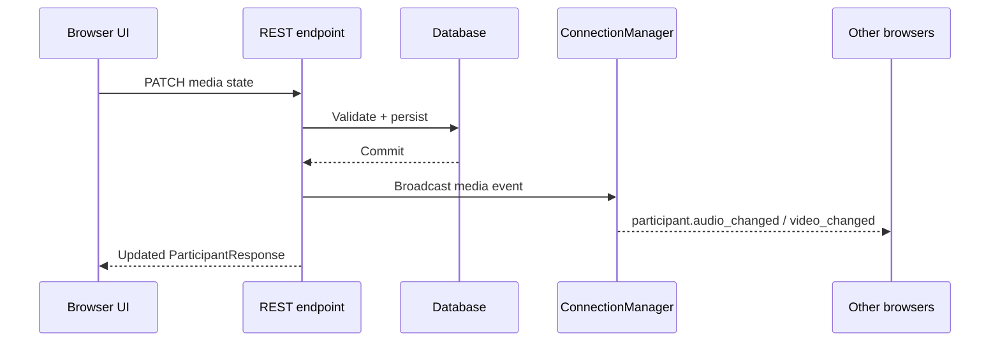

# REST API Reference

Base URL: `http://localhost:8000/api/v1`

Interactive references:

- Swagger UI: `http://localhost:8000/docs`
- ReDoc: `http://localhost:8000/redoc`

## Conventions

- Request and response bodies use JSON.
- Timestamps are ISO 8601 UTC strings.
- Participant-scoped operations require `actor_participant_id` as a query parameter.
- Domain errors use a consistent shape:

```json
{
  "error": {
    "code": "INVALID_PASSCODE",
    "message": "The supplied passcode is invalid."
  }
}
```

## Endpoint map

### Health and identity

| Method | Path | Purpose |
| --- | --- | --- |
| `GET` | `/health` | Verify service and database availability |
| `POST` | `/auth/register` | Register a local user |
| `POST` | `/auth/login` | Issue an access token |
| `POST` | `/auth/logout` | End the current auth session |
| `GET` | `/auth/me` | Return the current user |
| `GET` | `/users/me` | Return the current/default user profile |

### Meetings

| Method | Path | Purpose |
| --- | --- | --- |
| `POST` | `/meetings` | Create an instant `LIVE` meeting |
| `POST` | `/meetings/schedule` | Schedule a future meeting |
| `GET` | `/meetings/upcoming` | List upcoming meetings |
| `GET` | `/meetings/recent?page=1&page_size=20` | Paginated recent meetings |
| `GET` | `/meetings/{meeting_id}` | Read public meeting details |
| `POST` | `/meetings/{meeting_id}/start?actor_participant_id={pid}` | Host starts a scheduled meeting |
| `POST` | `/meetings/{meeting_id}/end?actor_participant_id={pid}` | Host ends a live meeting |

Create an instant meeting:

```http
POST /api/v1/meetings
Content-Type: application/json

{"title":"Design sync","description":"Weekly review"}
```

The response includes a public 10-digit meeting ID, passcode, invite token/link, lifecycle status and host information.

### Participants and moderation

| Method | Path | Purpose |
| --- | --- | --- |
| `POST` | `/meetings/join` | Join by meeting ID and passcode |
| `POST` | `/meetings/join-by-invite` | Join with an invite token |
| `GET` | `/meetings/{meeting_id}/participants` | List active participants |
| `POST` | `/meetings/{meeting_id}/participants/{pid}/leave?actor_participant_id={pid}` | Leave voluntarily |
| `PATCH` | `/meetings/{meeting_id}/participants/{pid}/audio?actor_participant_id={pid}` | Set microphone state |
| `PATCH` | `/meetings/{meeting_id}/participants/{pid}/video?actor_participant_id={pid}` | Set camera state |
| `PATCH` | `/meetings/{meeting_id}/participants/{pid}/screen-share?actor_participant_id={pid}` | Set screen-share state |
| `POST` | `/meetings/{meeting_id}/participants/{pid}/mute?actor_participant_id={host_pid}` | Host mutes one participant |
| `POST` | `/meetings/{meeting_id}/mute-all?actor_participant_id={host_pid}` | Host mutes all non-host participants |
| `DELETE` | `/meetings/{meeting_id}/participants/{pid}?actor_participant_id={host_pid}` | Host removes a participant |

Join request:

```json
{
  "meeting_id": "8461249264",
  "display_name": "Priya Sharma",
  "passcode": "eWklt0"
}
```

Media state requests:

```json
{"enabled": true}
```

```json
{"sharing": true}
```

### Chat and reactions

| Method | Path | Purpose |
| --- | --- | --- |
| `GET` | `/meetings/{meeting_id}/chat` | Read chronological chat history |
| `POST` | `/meetings/{meeting_id}/chat` | Persist and broadcast a chat message |
| `POST` | `/meetings/{meeting_id}/reactions` | Persist and broadcast an emoji reaction |

Chat request:

```json
{
  "participant_id": "opaque-participant-id",
  "message": "Hello everyone"
}
```

Reaction types: `thumbs_up`, `clap`, `heart`, `laugh`, `surprised`, `celebrate`.

## REST-to-realtime relationship

REST mutations are authoritative for durable participant/media state. After a successful mutation, the service broadcasts a WebSocket event so every connected client updates without polling or refreshing the page.


