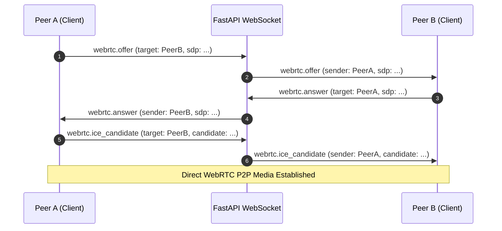

# WebSocket Protocol & WebRTC Signaling Reference

Endpoint: `ws://127.0.0.1:8000/api/v1/ws/meetings/{meeting_id}?participant_id={participant_id}`

---

## 1. Handshake & Authentication

To establish a WebSocket connection:
1. Participant must join the meeting via REST (`POST /api/v1/meetings/join` or `POST /api/v1/meetings/join-by-invite`).
2. The response supplies an opaque `participant_id` and the WebSocket connection URL.
3. Upon opening the WebSocket connection with the query parameter `?participant_id={participant_id}`, the server validates:
   - Meeting exists and is in `live` or `waiting` status.
   - Participant exists, is assigned to this meeting, and `is_active == True`.
4. If validation fails, connection is closed with status code `4003` (Forbidden).

---

## 2. WebRTC Peer-to-Peer Signaling

The WebSocket connection acts as an authenticated signaling bus exchanging SDP session descriptions and ICE network candidates between participants.



### Offer Payload (Client -> Server)
```json
{
  "type": "webrtc.offer",
  "data": {
    "target_participant_id": "PARTICIPANT_B_ID",
    "sdp": "v=0\r\no=- 42 2 IN IP4 127.0.0.1...",
    "type": "offer"
  }
}
```

### Answer Payload (Client -> Server)
```json
{
  "type": "webrtc.answer",
  "data": {
    "target_participant_id": "PARTICIPANT_A_ID",
    "sdp": "v=0\r\no=- 43 2 IN IP4 127.0.0.1...",
    "type": "answer"
  }
}
```

### ICE Candidate Payload
```json
{
  "type": "webrtc.ice_candidate",
  "data": {
    "target_participant_id": "TARGET_ID",
    "candidate": {
      "candidate": "candidate:1 1 UDP 2130706431 192.168.1.1 50000 typ host ...",
      "sdpMid": "0",
      "sdpMLineIndex": 0
    }
  }
}
```

---

## 3. Realtime Broadcast Events (Server -> Client)

All server-broadcast events adhere to the standard envelope:
```json
{
  "event": "<event_name>",
  "meeting_id": "8461249264",
  "data": { ... },
  "timestamp": "2026-09-07T10:30:00Z"
}
```

### Supported Broadcast Events
| Event Name | Trigger |
|---|---|
| `participant.joined` | New participant enters the room |
| `participant.left` | Participant disconnects or leaves |
| `participant.removed` | Host removes participant from meeting |
| `participant.audio_changed` | Participant toggles microphone |
| `participant.video_changed` | Participant toggles camera |
| `participant.muted` / `unmuted` | Host mutes/unmutes participant |
| `screen_share.started` | Participant starts screen sharing |
| `screen_share.stopped` | Participant stops screen sharing |
| `host.mute_all` | Host triggers mute-all |
| `chat.message_created` | New message sent to in-meeting chat |
| `reaction.created` | New emoji reaction submitted |
| `meeting.started` | Host starts scheduled meeting |
| `meeting.ended` | Host ends meeting for everyone |
