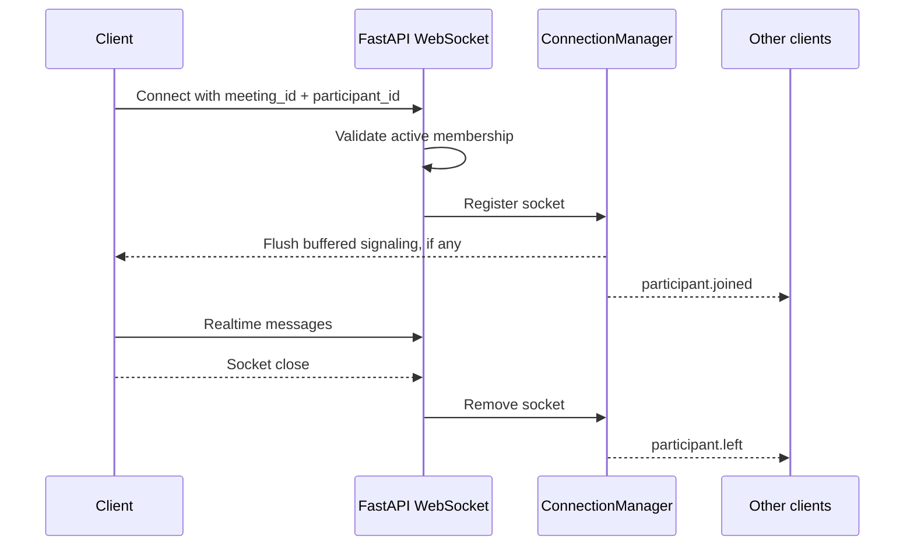
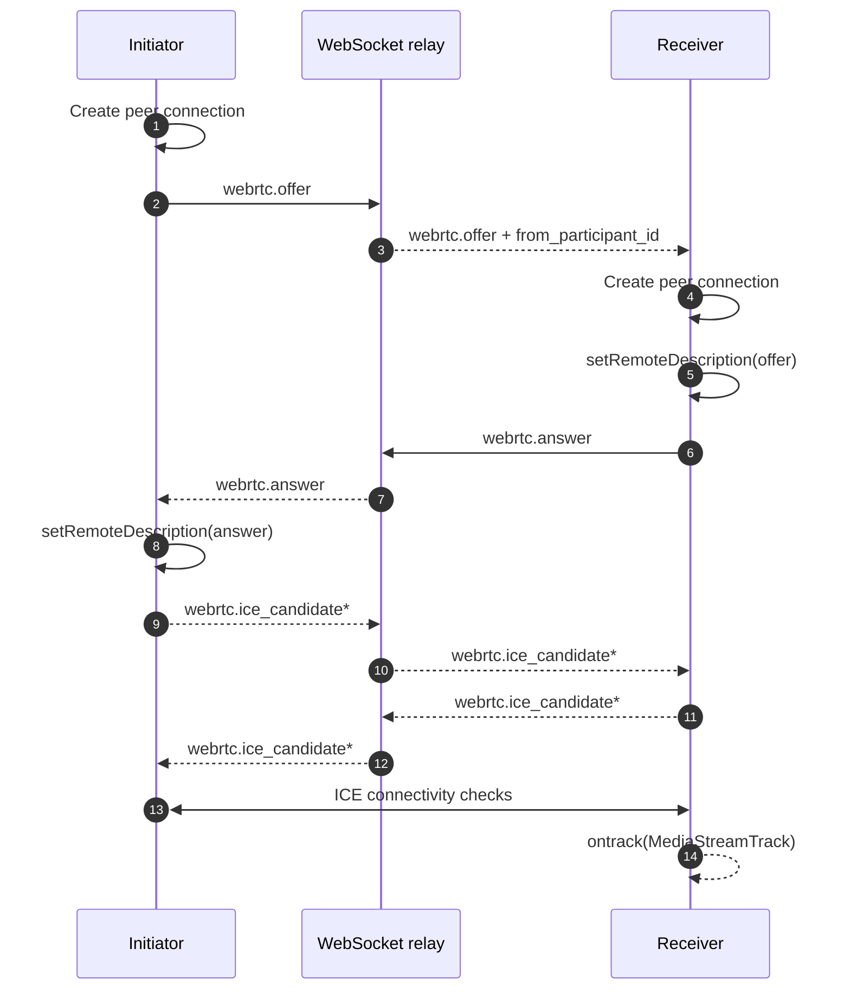

# WebSocket and WebRTC Protocol

Endpoint:

```text
ws://localhost:8000/api/v1/ws/meetings/{meeting_id}?participant_id={participant_id}
```

Use `wss://` behind HTTPS.

## Connection lifecycle



The join event is emitted after the socket is registered. This makes a new participant reachable for signaling before another client starts negotiation.

## Event envelope

All server events use:

```json
{
  "type": "participant.joined",
  "meeting_id": "8461249264",
  "timestamp": "2026-09-08T10:30:00+00:00",
  "payload": {}
}
```

Client signaling messages add `target_participant_id` at the top level:

```json
{
  "type": "webrtc.offer",
  "target_participant_id": "target-participant-id",
  "payload": {
    "sdp": "v=0...",
    "type": "offer"
  }
}
```

The server injects `from_participant_id` into forwarded signaling payloads.

## Event catalog

| Event | Direction | Meaning |
| --- | --- | --- |
| `meeting.started` / `meeting.ended` | Server → clients | Meeting lifecycle changed |
| `participant.joined` / `participant.left` | Server → clients | Presence changed |
| `participant.removed` | Server → clients | Host removed a participant |
| `participant.audio_changed` | Server → clients | Microphone state changed |
| `participant.video_changed` | Server → clients | Camera state changed |
| `participant.muted` / `participant.unmuted` | Server → clients | Host moderation state |
| `screen_share.started` / `.stopped` | Server → clients | Screen sharing changed |
| `chat.message_created` | Server → clients | New persisted chat message |
| `reaction.created` | Server → clients | New reaction |
| `host.mute_all` | Server → clients | Host muted all non-host participants |
| `webrtc.offer` | Client ↔ server relay | SDP offer |
| `webrtc.answer` | Client ↔ server relay | SDP answer |
| `webrtc.ice_candidate` | Client ↔ server relay | ICE candidate |
| `ping` / `pong` | Client ↔ server | Connectivity check |

## WebRTC negotiation



### Reliability rules

- Exactly one client initiates a pair using a deterministic participant-ID ordering.
- The server buffers targeted signaling events if the target socket is not registered yet.
- The client queues ICE candidates until the matching remote description exists.
- Signaling operations are serialized per remote participant to prevent offer/answer races.
- Leaving or removal closes the peer connection, removes the remote stream and clears queued candidates.
- Camera/microphone state is a durable REST mutation plus a realtime state event; media itself stays on the WebRTC connection.

## Close codes and errors

| Code | Meaning |
| --- | --- |
| `4001` | Participant not found or inactive |
| `4003` | Participant does not belong to the meeting |
| `4004` | Meeting not found |

Invalid client messages receive an `error` event with a machine-readable `payload.code` and human-readable `payload.message`.
