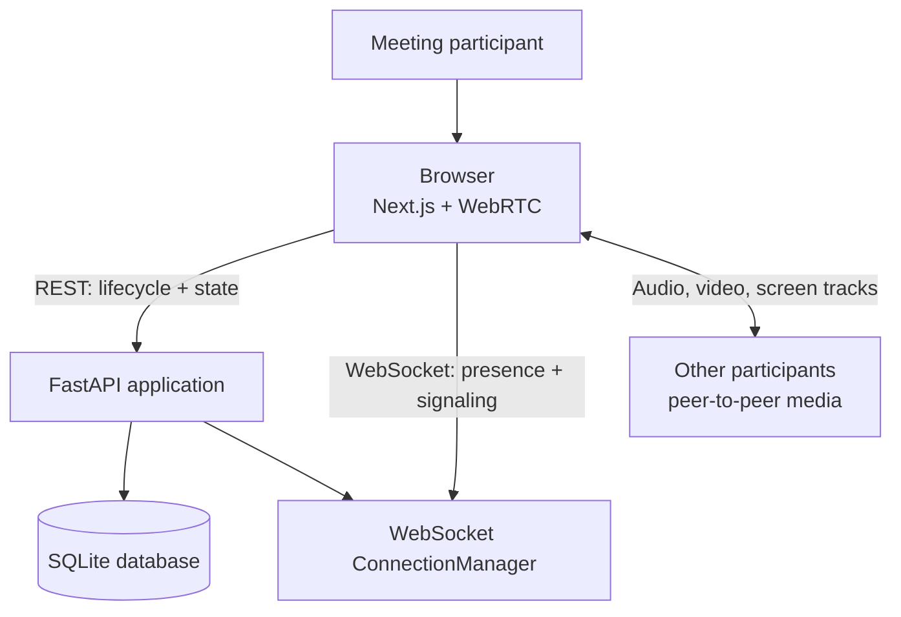
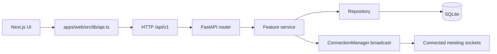
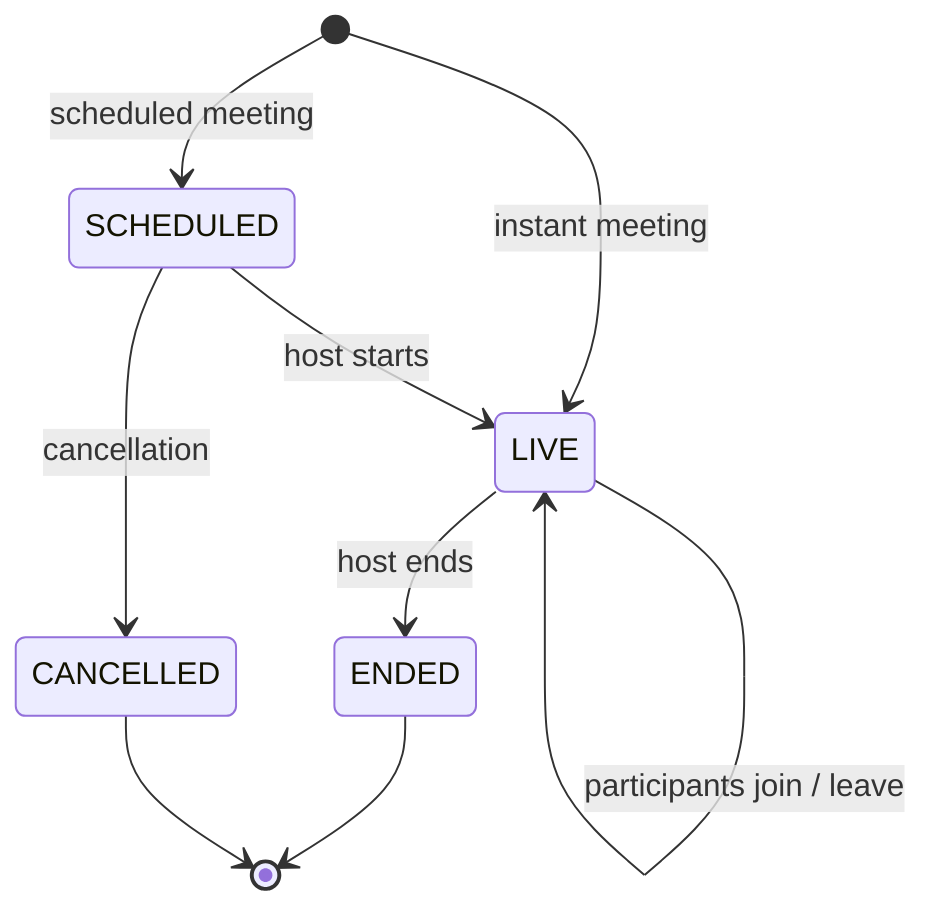
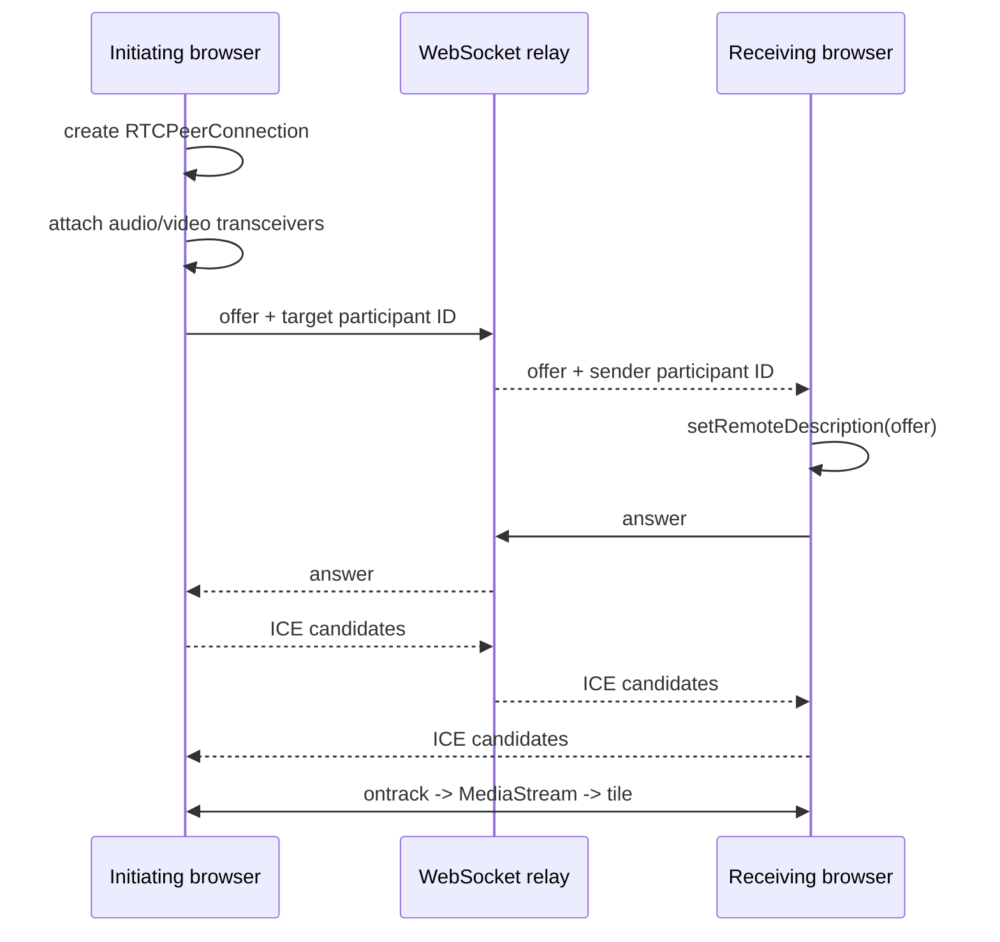
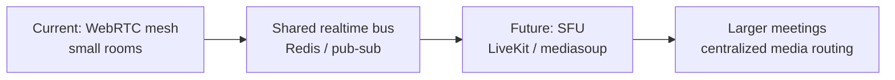

# Architecture Overview

> **Design goal** · keep the meeting workflow simple to run locally, explicit at each boundary, and ready to evolve beyond a single-process prototype.

## System context

## Module ownership

| Module | Owns | Does not own |
| --- | --- | --- |
| `apps/web` | Routes, meeting UI, browser permissions, `RTCPeerConnection` lifecycle | Database rules or meeting authorization |
| `apps/api/app/features/meetings` | Meeting creation, scheduling and lifecycle transitions | Browser media transport |
| `apps/api/app/features/participants` | Join/leave, media flags and host moderation | SDP parsing or media forwarding |
| `apps/api/app/features/realtime` | WebSocket authentication, event broadcast and signaling relay | Business persistence |
| `apps/api/app/features/chat` | Chat persistence and broadcast | WebRTC state |
| `apps/api/app/features/reactions` | Reaction persistence and broadcast | Meeting lifecycle |
| `packages/contracts` | Shared TypeScript DTOs and event names | Runtime validation on the server |
| `packages/ui` | Reusable visual primitives and class utilities | Application state |

## Request and event paths

## Meeting lifecycle

## WebRTC design

The server is a signaling relay, not a media server. Each browser creates one `RTCPeerConnection` per remote participant. The current implementation uses:

1. A deterministic initiator per participant pair to avoid offer collisions.
2. Server-side buffering when a participant has completed REST join but has not registered its socket yet.
3. Per-peer client signaling queues so SDP and ICE operations are processed in order.
4. ICE candidate queues until the remote description exists.
5. React state updates when `ontrack` fires so tiles render the latest `MediaStream` without reloads.

## Scaling path

The REST contracts and domain services are deliberately independent of the media transport so an SFU can replace the mesh without redesigning persistence.

## Non-functional notes

- All API timestamps are UTC.
- Public meeting and participant identifiers are opaque; internal database IDs are not exposed by the client API.
- SQLite is selected for zero-infrastructure local development. Use managed Postgres for durable multi-instance production.
- The in-memory `ConnectionManager` is process-local. Shared state is required before running multiple API instances.
