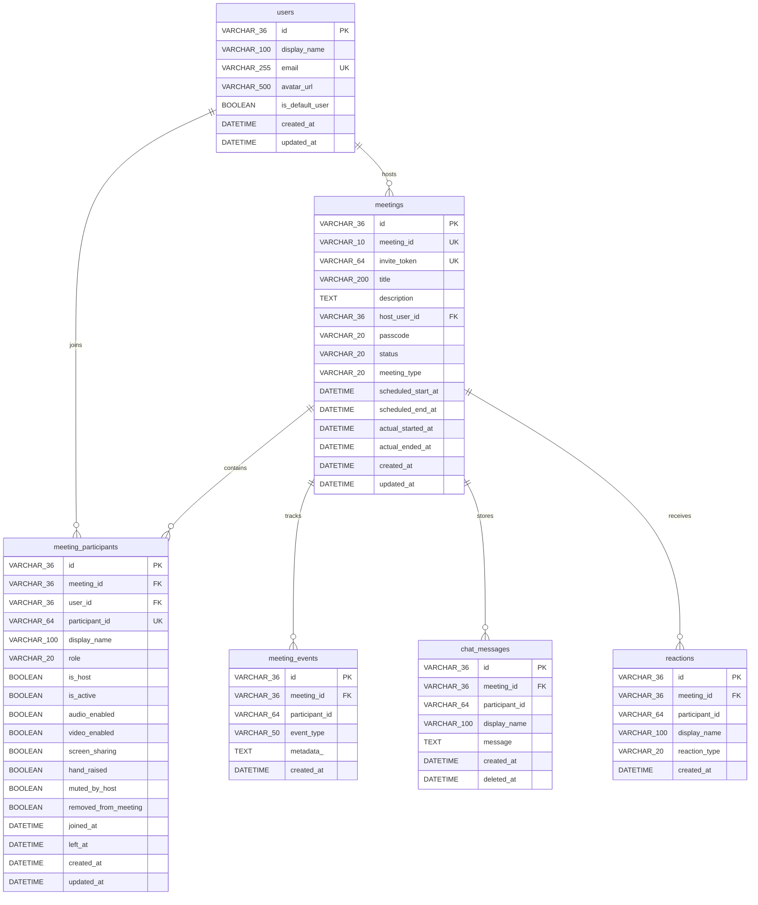

# Database Architecture & Schema Specification

The database is powered by asynchronous SQLite (`sqlite+aiosqlite`) using modern SQLAlchemy 2.0 ORM patterns and Alembic migrations.

---

## 1. Entity-Relationship Diagram

---

## 2. Table Indexing & Optimization

- **`meetings`**:
  - `ix_meetings_meeting_id` on `meeting_id` (Unique lookup for joins)
  - `ix_meetings_invite_token` on `invite_token` (Unique lookup for invite links)
  - `ix_meetings_host_user_id` on `host_user_id` (Filtered queries for upcoming/recent lists)
  - `ix_meetings_status` on `status` (Lifecycle state queries)
- **`meeting_participants`**:
  - `ix_meeting_participants_participant_id` on `participant_id` (Opaque lookup on WebSocket & REST)
  - `ix_meeting_participants_meeting_id` on `meeting_id` (Participant lists per meeting)
  - `ix_meeting_participants_is_active` on `is_active` (Active participant counts and state filters)

---

## 3. SQLite Compatibility & Conventions

1. **UUIDs**: Stored as canonical `VARCHAR(36)` strings. Avoids driver parameter binding issues with Python `uuid.UUID` objects in `aiosqlite`.
2. **Relationships**: Configured with `lazy="selectin"` to ensure asynchronous eager loading without triggering greenlet execution faults.
3. **Foreign Keys**: Enabled via PRAGMA `foreign_keys = ON` on all SQLite connection handshakes.
