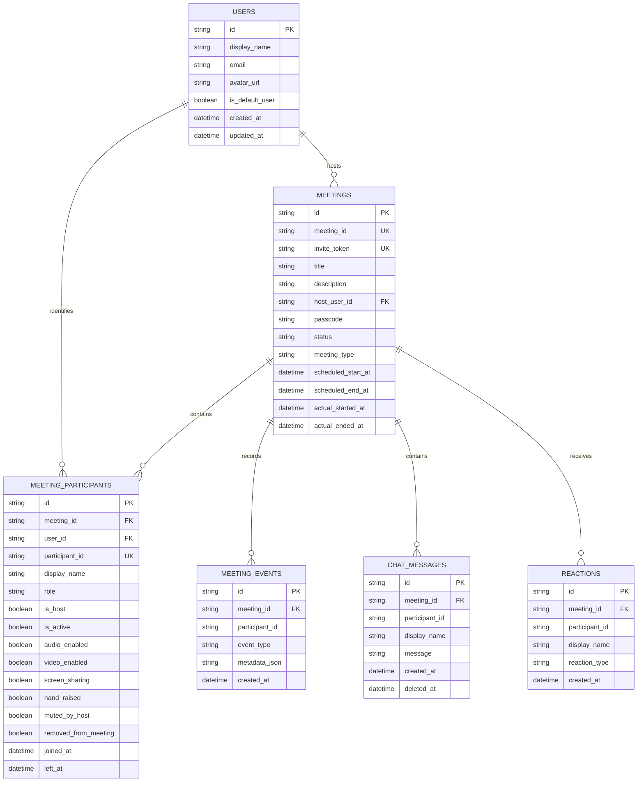

# Database Schema

The backend uses SQLAlchemy 2.0 async ORM with `aiosqlite` and Alembic migrations. Local development defaults to `apps/api/data/zoom_clone.db`.

## Entity relationship model



## Table responsibilities

| Table | Responsibility |
| --- | --- |
| `users` | Local user identity and profile data |
| `meetings` | Public meeting identity, lifecycle, schedule and host ownership |
| `meeting_participants` | Per-session presence, role, device state and moderation flags |
| `meeting_events` | Audit trail for lifecycle and participant actions |
| `chat_messages` | Durable in-meeting chat history |
| `reactions` | Durable reaction records used for realtime reaction events |

## Conventions

- Database primary keys are UUID strings (`VARCHAR(36)`), while public meeting and participant IDs are opaque generated strings.
- Foreign keys are enabled on SQLite connections.
- Async relationships use `selectin` loading to avoid implicit synchronous IO.
- Lifecycle flags are explicit: a participant can be inactive or removed without deleting the historical row.
- All timestamps are stored and returned in UTC.

## Indexing strategy

Important lookups are indexed on:

- `meetings.meeting_id`
- `meetings.invite_token`
- `meetings.host_user_id`
- `meetings.status`
- `meeting_participants.participant_id`
- `meeting_participants.meeting_id`
- `meeting_participants.is_active`

## Migration workflow

```bash
cd apps/api
export PYTHONPATH=.
python -m alembic upgrade head
python -m alembic current
```

Create a new migration after changing SQLAlchemy models:

```bash
python -m alembic revision --autogenerate -m "describe schema change"
python -m alembic upgrade head
```
