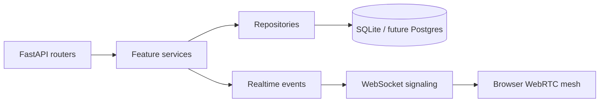

# ADR 001: Modular Monolith and WebRTC Mesh

| Field | Decision |
| --- | --- |
| Status | Accepted |
| Date | 2026-09-08 |
| Scope | Application structure, realtime signaling and media transport |

## Context

The project needs meeting lifecycle coordination, participant presence, host controls, chat, reactions and browser audio/video while remaining easy to install and evaluate. A distributed stack with separate services, Redis and an SFU would add operational overhead before the product boundaries are proven.

## Decision

Use a **modular monolith** for the API and a **peer-to-peer WebRTC mesh** for media.

The feature boundaries are:

- `users`: identity and profile access.
- `meetings`: creation, scheduling and lifecycle state machine.
- `participants`: join/leave, media flags and moderation.
- `realtime`: WebSocket registry, event envelopes and WebRTC relay.
- `chat`: persisted chat and broadcast.
- `reactions`: reaction records and broadcast.

## Why this fits the project

### Benefits

- One API process and one SQLite database provide zero-infrastructure local setup.
- Domain services keep routers thin and business rules testable.
- WebSocket signaling is decoupled from media transport.
- Shared TypeScript contracts make client/server payload changes visible.
- The database model can remain stable if media transport changes later.

### Trade-offs

- P2P mesh bandwidth grows with participant count and is best for small rooms.
- The in-memory connection registry is process-local.
- SQLite is not the desired durable store for horizontally scaled production.
- TURN and SFU infrastructure are not included in the prototype deployment.

## Consequences

### Positive

- Developers can run the full stack with Python, Node.js and a browser.
- Meeting state, authorization and persistence remain on the server.
- WebRTC synchronization can be tested independently from the REST domain services.

### Negative

- Scaling requires replacing or extending the in-memory realtime layer.
- Larger meetings require an SFU such as LiveKit or mediasoup.
- Production security, observability, backups and compliance need additional work.

## Revisit criteria

Reconsider this decision when any of the following becomes true:

1. Meetings regularly exceed the practical P2P mesh size.
2. Multiple API instances are required.
3. Durable production storage and cross-region recovery become requirements.
4. A managed identity, media or realtime platform is available and justified.
