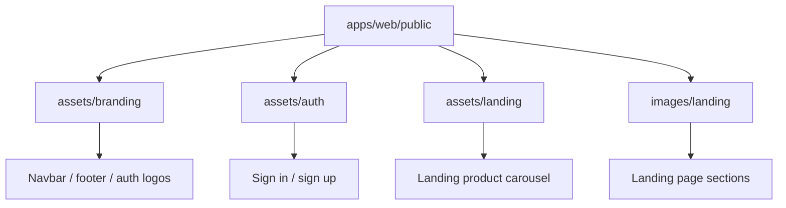

# Frontend Asset Catalog

Static assets live under `apps/web/public` and are referenced by URL from the Next.js application. Keep brand assets, authentication art and landing-page imagery separated so visual updates remain easy to review.

## Asset groups

| Directory | Used by | Content |
| --- | --- | --- |
| `assets/branding/` | Navigation, footer, auth and join flows | Zoom wordmarks and brand variants |
| `assets/auth/` | Sign-in and sign-up screens | Promotional and onboarding artwork |
| `assets/landing/carousel/` | Product carousel | Product and customer story imagery |
| `images/landing/` | Landing page content sections | Conference, webinar and marketing images |

## Guidelines

- Prefer WebP or appropriately compressed JPEG for photographic assets.
- Use the supplied brand PNGs instead of recreating or stretching logos in SVG.
- Keep decorative assets in `public`; keep component-specific layout and styling in the component that renders them.
- Use descriptive filenames and update this catalog when adding a new asset family.
- Do not store secrets, user uploads or generated meeting media in `public`.
